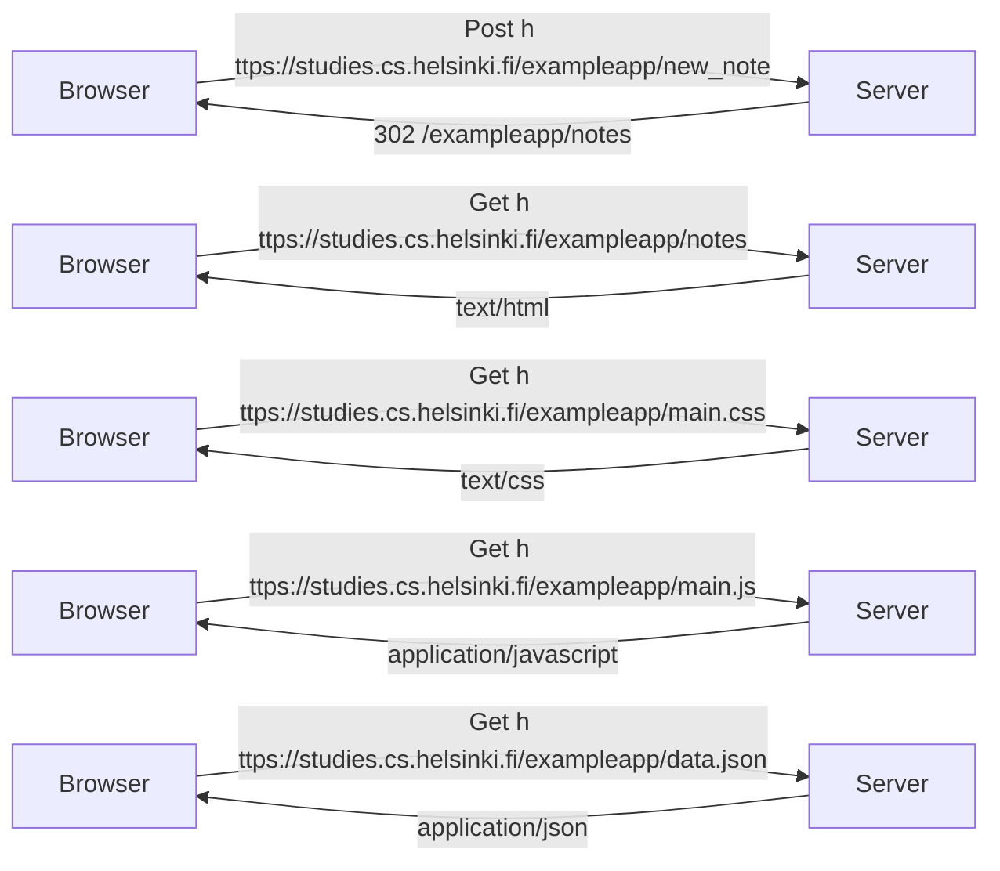

```mermaid
flowchart LR
  A[Browser]--"Post h ttps://studies.cs.helsinki.fi/exampleapp/new_note" --> B[Server]
  B[Server] --302 /exampleapp/notes--> A[Browser]

  C[Browser] --"Get h ttps://studies.cs.helsinki.fi/exampleapp/notes"--> D[Server]
  D[Server] --"text/html"--> C[Browser]

  E[Browser] --"Get h ttps://studies.cs.helsinki.fi/exampleapp/main.css"--> F[Server]
  F[Server] --"text/css"--> E[Browser]

  G[Browser]--"Get h ttps://studies.cs.helsinki.fi/exampleapp/main.js"--> H[Server]
  H[Server] --"application/javascript"--> G[Browser]

  I[Browser] --"Get h ttps://studies.cs.helsinki.fi/exampleapp/data.json"--> J[Server]
  J[Server] --"application/json"--> I[Browser]
```

