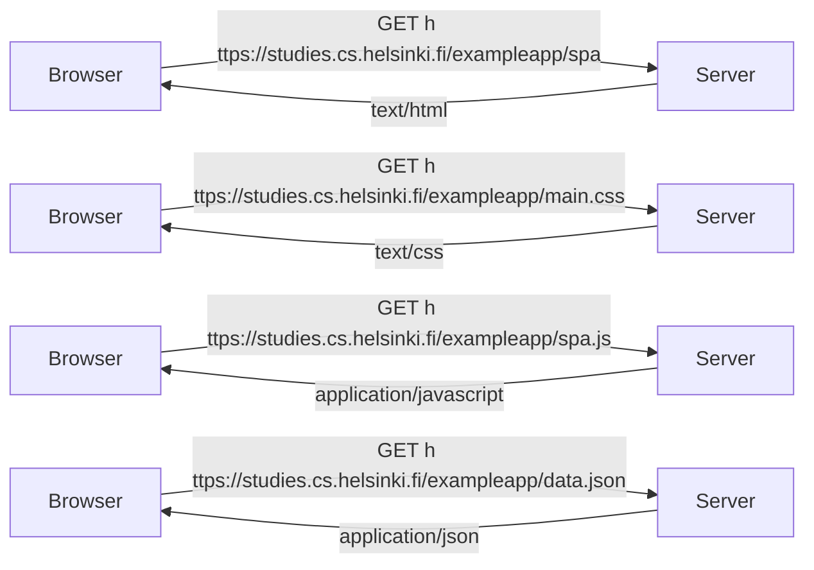

```mermaid
flowchart LR
  A[Browser] -- "GET h ttps://studies.cs.helsinki.fi/exampleapp/spa" -->B[Server]
  B--"text/html"-->A

  C[Browser] -- "GET h ttps://studies.cs.helsinki.fi/exampleapp/main.css" -->D[Server]
  D--"text/css"-->C

  E[Browser] -- "GET h ttps://studies.cs.helsinki.fi/exampleapp/spa.js" -->F[Server]
  F--"application/javascript"-->E
  
  G[Browser] -- "GET h ttps://studies.cs.helsinki.fi/exampleapp/data.json" -->H[Server]
  H--"application/json"-->G
```
